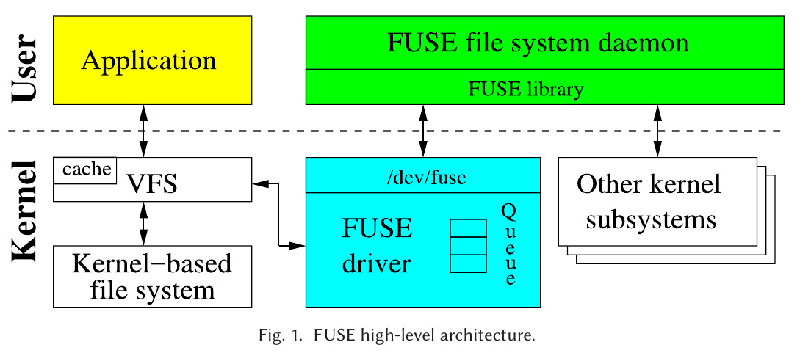

# Excersise 0x
## Working with Filesystems

## Writing our own FAT12 FS Driver with FUSE
The following will be the biggest tasks in all exercises of this lecture.
We will build a simple-as-possible read-only FAT12 filesystem driver that should be functioning on Linux and macOS.

FAT is a file system developed by Microsoft back in 1977. Despite its age, it's still heavily in use today, especially on smaller external storage devices. Due to the enormous increase of available storage on storage devices since 1977, multiple versions of FAT evolved over time that are all backward capable and share the same concepts. In this task, however, we only implement a filesystem driver for FAT12 - the initial version of FAT.

Information on the Design can be found this [this quite detailed Wikipedia entry](https://en.wikipedia.org/wiki/Design_of_the_FAT_file_system) and the [official specification from Microsoft]

Normally drivers on Linux are executed as kernel modules directly in kernel mode as Linux is a monolithic OS. To be able to utilize the advantages of a hybrid kernel, FUSE (Filesystem in Userspace) offers the possibility to realize file system drivers as userspace applications.

Overview of the High-Level Architecture of FUSE [1]

1. Inspect the Spec. Try to answer the following questions:
    a. What is a block/sector, a cluster?
    b. What is the purpose of the File-Allocation-Table (FAT)?
    c. What is the order of the sector that describes the fs?
    d. How to calculate the offset of these sectors?
    e. How to calculate the offset of the cluster of a file?
2. Inspect the file `fuse_fat.c`. You see a couple of function stubs, the purpose of those is explained on this `fat_ops` struct.
3. Implement the `fat_init` function. Here we have to open the image file and read and parse the Boot Sector, which contains important information and offsets for later use. Also, store this information in the `fat_fs` struct.
4. Implement the 

[1]: https://georgesims21.github.io/posts/fuse/